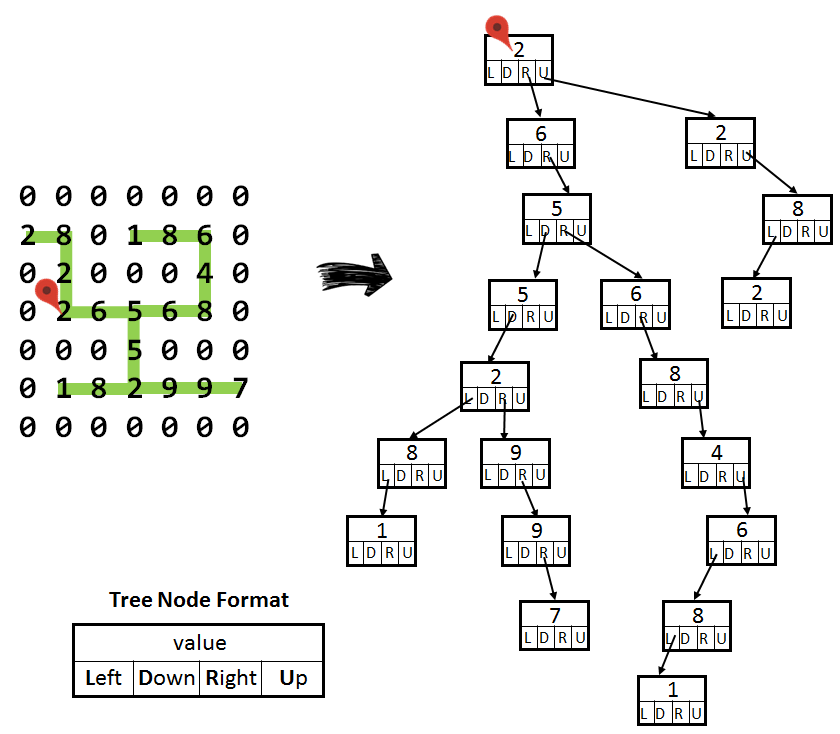

# Matrix to Tree Converter
### Description
- Given
  - A matrix of digits
  - A starting non-zero digit
  - A traversal method
- Task
  - Convert the nonzero digits of the path in matrix into a tree
  - Print out the digits according to one of the following tree traversal methods
    - Level-order-traversal
    - Pre-order-traversal
    - Post-order-traversal
- Example

